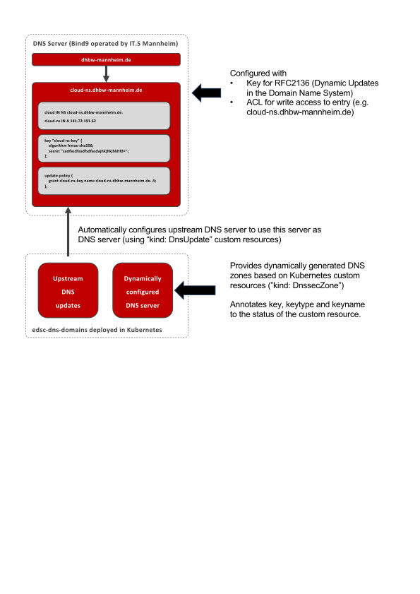

# Bind9 Config Creator for Kubernetes' external-dns

This project allows to reconfigure a [Bind9](https://www.isc.org/bind/) DNS server running in [Kubernetes](https://kubernetes.io/) dynamically using [Custom Resources](https://kubernetes.io/docs/concepts/extend-kubernetes/api-extension/custom-resources/). It watches custom resources of type `DnssecZone` and updates a Bind9 configuration accordingly. In addition, it watches custom resources of type `DnsUpdate` and updates a remote DNS server using [RFC 2136](https://tools.ietf.org/html/rfc2136). This allows to provide a dynamically deployed DNS server to be used for a certain zone. 

This project supports configuring (and running) a Bind9 server by adding/removing/modifying custom resources in Kubernetes. It creates the required configuration files and key material and attaches this information to the status of the individual custom resources.

## Update a Remote DNS Server Using [RFC2136](https://datatracker.ietf.org/doc/html/rfc2136)

Create a YAML file (e.g., `filename.yaml`) that defines a zone and apply it using `kubectl apply -f filename.yaml`:

```yaml
apiVersion: dnsseczone.farberg.de/v1
kind: DnsUpdate
metadata:
  name: dnsupdate-test
spec:
  # The DNS server to update (using RFC 2136). IP address or hostname.
  dnsserver: bama9.dhbw-mannheim.de.
  # The key to use for the update. Format: hmac-type:keyname:key
  keystring: hmac-sha256:the-name-of-the-key:83c7cad3e61894d88595635f4f5846ede60513f31d751f545607bebf967b7fcb
  # The records to create
  records:
    # Example for a fully specified record (i.e., name and contents)
    - name: name-of-the-1st-record.cloud.dhbw-mannheim.de.
      # Time-to-live in seconds
      ttl_seconds: 60
      # The type and contents of the record
      record:
        type: A
        contents: 141.111.222.111
    # Example for a records that reads its contents from a Kubernetes service
    - name: name-of-the-2nd-record.cloud.dhbw-mannheim.de.
      # Time-to-live in seconds
      ttl_seconds: 60
      # Namespace and name of the service in Kubernetes
      service:
        namespace: "default"
        name: "bind-dnssec-config-service"
```

### Define a Zone in the DNS server

Define a zone (`someusername.user.cloud.dhbw-mannheim.de`) and apply it using `kubectl apply -f filename.yaml`:

```yaml
apiVersion: dnsseczone.farberg.de/v1
kind: DnssecZone
metadata:
  name: some-name
  namespace: default
spec:
  domainName: someusername.user.cloud.dhbw-mannheim.de
  adminContact: admin.someusername.user.cloud.dhbw-mannheim.de
  expireSeconds: 60
  minimumSeconds: 60
  refreshSeconds: 60
  retrySeconds: 60
  ttlSeconds: 60
  associatedPrincipals:
    - test
    - blablubb
```

The controller creates Bind9 config files and key material. It then adds data required to configure external-dns in the status of the custom resource:

```yaml
apiVersion: dnsseczone.farberg.de/v1
kind: DnssecZone
metadata:
  name: some-name
  namespace: default
spec:
  domainName: someusername.user.cloud.dhbw-mannheim.de
  adminContact: admin.someusername.user.cloud.dhbw-mannheim.de
  expireSeconds: 60
  minimumSeconds: 60
  refreshSeconds: 60
  retrySeconds: 60
  ttlSeconds: 60
  associatedPrincipals:
    - test
    - blablubb
status:
  dnssecAlgorithm: hmac-sha512
  dnssecKey: +bGKiHE6E8FP3fif/OD+mwqte6WCdYCdTN5Ur+RrTHSRlk7sRd/p1FCbo8aqP4Oc5nt5sCaBJCLfHi/zSa9jRA==
  keyName: someusername.user.cloud.dhbw-mannheim.de
```

## Running and Development

### Run locally

```bash
npm install # Install required modules
npm run build # Compile the nearley grammar for bind key files
npm run dryrun # Run a local dry-run
kubectl apply -f test/example-record.yaml # Add a custom resource
```

### Develop using [Skaffold](https://skaffold.dev/)

Make sure Kubernetes is running and available and then run `skaffold dev`

### Deploy to Kubernetes

Option 1: Manual deployment
- Create a deployment similar to [this one](k8s/k8s-deployment.yaml)
- Deploy it using `kubectl apply -f your-filename.yaml`.

Option 2: Use Skaffold
- Run `npm run deploy`

### Build the Docker container

Run `docker build -t farberg/bind-dnssec-config controller/` and `docker build -t farberg/bind-dnssec-runner bindrunner`


## Use Case

<div style="text-align: center">
  
</div>

## Testing

```console
HMAC="hmac-sha512:my-awesome-keyname:THEKEYINBASE64FORMAT"
RECORD='test.user.cloud.dhbw-mannheim.de. 900 IN TXT "Hello, how are you?"'
echo -e "server cloud-ns.dhbw-mannheim.de\nupdate add $RECORD\nsend\n" | nsupdate -y "$HMAC"
```

## FAQ

I'm getting errors like `Exception in main method: Error: customresourcedefinitions.apiextensions.k8s.io is forbidden: User "system:serviceaccount:default:default" cannot create resource "customresourcedefinitions" in API group "apiextensions.k8s.io" at the cluster scope`
- Create missing RBAC roles
- For development (e.g., in Minikube), run `kubectl create clusterrolebinding --clusterrole=cluster-admin --user=system:serviceaccount:default:default --clusterrole=cluster-admin --user=system:serviceaccount rds-admin-binding`


## Internal Notes

Convert use case from PDF to SVG: ``NAME="use-case-dhbw-mannheim.pdf" ; pdfcrop --margins 0 "$NAME" "tmp.pdf" && pdf2svg	"tmp.pdf" `basename "$NAME" .pdf`.svg && rm tmp.pdf``
